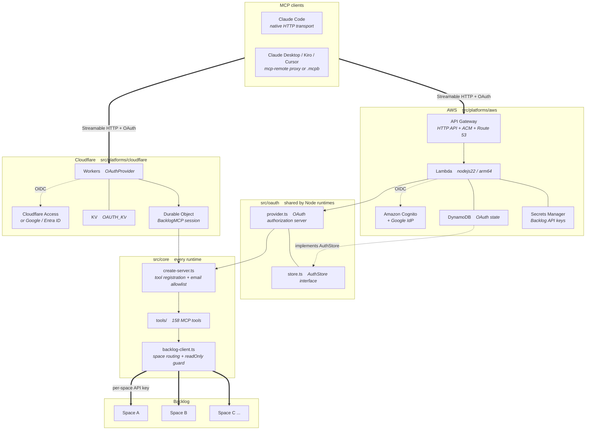
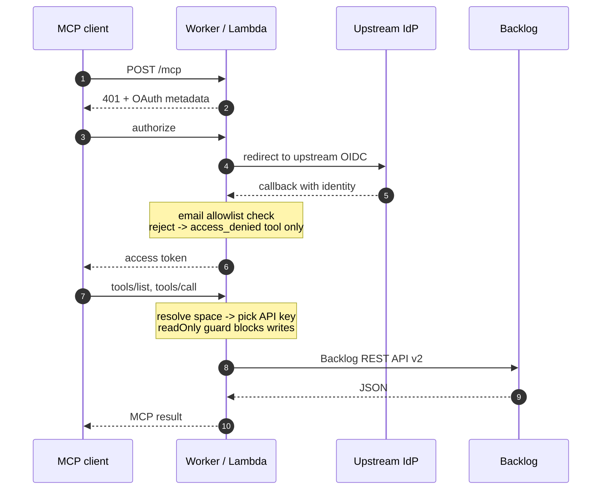

# Backlog Remote MCP Server

A remote MCP (Model Context Protocol) server for Backlog.
**Deployable to either Cloudflare Workers or AWS.**

English | [日本語](README_ja.md)

## Features

- **Multi-space** — serve several Backlog spaces from one server
- **Read-only guard** — mark a shared space `readOnly` to reject every write API call
- **OAuth 2.1 + PKCE** — supports Dynamic Client Registration (DCR), so MCP clients connect directly
- **Email allowlist** — restrict who can use the server
- **Two runtimes** — the same business logic runs on Cloudflare or AWS

## Choosing a deployment

| | Cloudflare Workers | AWS |
|---|---|---|
| Runtime | Workers (edge) | Lambda + API Gateway HTTP API |
| MCP session | Durable Objects | Stateless |
| OAuth authorization server | `@cloudflare/workers-oauth-provider` | MCP SDK `mcpAuthRouter` |
| Upstream IdP | Cloudflare Access | Amazon Cognito |
| State storage | Workers KV | DynamoDB (TTL) |
| Secrets | Workers Secrets | Secrets Manager |
| IaC | wrangler | AWS SAM |
| Config file | `.dev.vars` | `infra/aws/params.yaml` |

The tools and their behavior are identical on both.

## Estimated Cost

> **Note**
> **These are reference figures only.** Actual charges vary by region, usage, and
> pricing changes. Use the official calculators for real estimates.
>
> - [Cloudflare Zero Trust pricing](https://www.cloudflare.com/plans/zero-trust-services/)
> - [Cloudflare Workers pricing](https://developers.cloudflare.com/workers/platform/pricing/)
> - [AWS Pricing Calculator](https://calculator.aws/#/addService)

### Assumptions

Personal use or a small team.

| Item | Assumption |
|---|---|
| Users | 1–5 |
| MCP requests | ~3,000 / month |
| Backlog spaces | 3 |
| Log retention | 30 days |

### Fixed costs (charged even when idle)

| | Cloudflare | AWS |
|---|---|---|
| Runtime | $0 (Free plan works) | $0 |
| Auth platform | $0 (Zero Trust free up to 50 users) | $0 (within Cognito free tier) |
| Secrets | $0 (Workers Secrets are free) | **~$0.80** (2 Secrets Manager secrets) |
| Certificates | $0 | $0 (public ACM certificates are free) |
| **Total** | **$0** | **~$1/month** |

**On AWS the fixed cost is essentially just Secrets Manager**, which bills per secret per
month whether or not it is used. Cloudflare has no fixed cost because Workers Secrets are
free.

### What is metered

| | Cloudflare | AWS |
|---|---|---|
| Requests | Workers | Lambda + API Gateway |
| State storage | Durable Objects + KV | DynamoDB |
| Logs | Workers Logs | CloudWatch Logs |

At the assumed volume (~3,000 requests/month) **both stay within the free allowances**.
API Gateway HTTP API has no perpetual free tier, so AWS accrues a small charge
proportional to request count (roughly $1 per million requests).

### Thresholds worth knowing

**Cloudflare — the 50-user line for Zero Trust**

Zero Trust (Access) is **free for up to 50 users**. Beyond that you move to a paid plan
billed **per user per month**. This is the cost that scales with headcount.

**Cloudflare — Workers Free plan limits**

This project uses SQLite-backed Durable Objects, which
[are available on the Workers Free plan](https://developers.cloudflare.com/durable-objects/platform/pricing/).
The Free plan does cap daily requests and other usage, and exceeding a cap returns errors.
For sustained use consider Workers Paid (from $5/month).

**AWS — the Lambda free tier is perpetual**

Lambda includes a perpetual free tier of 1M requests and 400,000 GB-seconds per month.
**API Gateway and Secrets Manager have no perpetual free tier.**

**AWS — CloudWatch Logs**

Logs are billed on ingestion volume. This template manages retention explicitly via
`LogRetentionDays` (default 30), so logs do not accumulate indefinitely.

### Summary

| Scale | Cloudflare | AWS |
|---|---|---|
| Personal | roughly $0 | ~$1/month |
| Tens of users (≤50) | roughly $0–$5 | $1 to a few dollars/month |
| 51+ users | Zero Trust switches to per-user billing | depends on the Cognito MAU free tier |

**For small teams Cloudflare is cheaper and has no fixed cost.** AWS carries the Secrets
Manager fixed cost but is worth it if you want to consolidate into an existing AWS
footprint or govern access through IAM.

## Setup

### 0. Prerequisites

Node.js 20 or later.

```bash
git clone <this-repo>
cd backlog-remote-mcp-server
npm install
```

Additional tools depend on the deployment target:

| Target | Requirements |
|---|---|
| Cloudflare Workers | Cloudflare account with Workers enabled, custom domain (optional) |
| AWS | AWS account, AWS CLI v2, AWS SAM CLI |

### Order to follow

1. **[Backlog API keys and space configuration](docs/backlog.md)** — shared by both platforms
2. Pick an identity provider
   - **[Google Cloud](docs/idp-google.md)**
   - **[Microsoft Entra ID](docs/idp-entra-id.md)**
3. Pick a deployment target
   - **[Cloudflare Workers](docs/deploy-cloudflare.md)**
   - **[AWS](docs/deploy-aws.md)**

### If something goes wrong

Troubleshooting sections live at the end of each deployment guide.

- [Cloudflare](docs/deploy-cloudflare.md#troubleshooting)
- [AWS](docs/deploy-aws.md#troubleshooting)


## Architecture

The same MCP server runs on two platforms. Each platform subgraph holds its own
wiring — gateway, storage and upstream IdP — and both funnel into the shared
`src/core`, which is where the tools and the Backlog client live.



### Request flow



Authorization happens in two layers. The upstream IdP decides **who** may sign in,
and the email allowlist decides **who gets tools**: a user outside the allowlist
receives a server exposing only `access_denied`. The `readOnly` flag on a space
rejects every non-GET request in the API client layer, so it cannot be bypassed by
an individual tool.

### Directory layout

Business logic is separated from runtime wiring.

```
src/
  core/                    Every runtime. Depends only on the MCP SDK and zod
    backlog-client.ts      Backlog API client (including the readOnly guard)
    tools/                 158 MCP tools (full public API coverage)
    create-server.ts       MCP server assembly and authorization
  oauth/                   Node runtimes. OAuth authorization server (Express)
    provider.ts            OAuthServerProvider implementation
    store.ts               AuthStore interface — the persistence port
    upstream.ts            Upstream OIDC client
    consent.ts             Consent screen
    app.ts                 Express app exposing /authorize, /token, /mcp, ...
  platforms/
    cloudflare/            Workers wiring (uses its own Workers OAuth provider)
    aws/                   Lambda wiring + DynamoDB / Secrets Manager adapters
infra/
  aws/                     SAM template and parameters
```

Three layers, by how widely each one can be reused:

- **`src/core`** depends only on `@modelcontextprotocol/sdk` and `zod` and references
  no runtime-specific API. Every platform uses it as-is.
- **`src/oauth`** is the OAuth authorization server. It is Express-based, so it needs
  Node, but it holds no cloud-specific code: persistence goes through the `AuthStore`
  interface and the upstream IdP through a generic OIDC client. Cloudflare does not
  use it — Workers has its own OAuth provider.
- **`src/platforms/<name>`** is the only place a cloud SDK appears.

Adding another Node-hosted platform (Cloud Run, Container Apps, ...) therefore means
implementing `AuthStore` for that platform's database, a secret lookup, and an entry
point that hands the Express app to the runtime. The authorization server, the tools
and the Backlog client are all reused unchanged.
## Connecting from MCP Clients

### Claude Desktop / Kiro / Cursor (via mcp-remote proxy)

```json
{
  "mcpServers": {
    "backlog": {
      "command": "npx",
      "args": [
        "mcp-remote",
        "https://<MCP_HOSTNAME>/mcp"
      ]
    }
  }
}
```

On first connection, a browser window opens for authentication.

### Claude Desktop (.mcpb bundle)

Instead of hand-editing the JSON above, you can double-click a `.mcpb`
(MCP Bundle) to install it. It is generated during deploy and written to `dist/`.

```bash
npm run mcpb:pack           # generate on its own
npm run aws:deploy          # generated as part of the deploy (Cloudflare: npm run cloudflare:deploy)
```

The endpoint URL is a `user_config` field, and **the domain you deployed to is
baked in as its default**. If you fork this and deploy to your own environment,
your deployment becomes the default. It can still be changed at install time.

Host name resolution order:

1. the `--host` argument
2. the `MCP_HOSTNAME` environment variable (shared with the Cloudflare deploy)
3. `ApiDomainName` in `infra/aws/params.yaml` (AWS deploy)
4. `MCP_HOSTNAME` in `.dev.vars`

**The bundle does not contain the server itself.** MCPB is a local-execution
format: a manifest's `server.type` can only be `node`, `python`, `binary` or
`uv`, and there is no type that points at a remote MCP server. The bundle ships
`mcp-remote` as a local stdio proxy that connects to your deployed server.
`mcp-remote` is vendored into the bundle so nothing is fetched over the network
at runtime.

Claude Code does not use this bundle — it stays on `claude mcp add --transport http`.

### MCP Inspector (for testing)

```bash
npx @modelcontextprotocol/inspector@latest
```

Enter `https://<MCP_HOSTNAME>/mcp` in the inspector and complete the OAuth flow via OAuth Settings.

## Usage

### Specifying a Space

All tools accept an optional `space` parameter:

```
# Use default space
"Show me the issues for PROJECT-KEY"

# Specify a particular space
"List projects in the PERSONAL space"
→ space: "PERSONAL"
```

### Examples

```
# List configured spaces
"What Backlog spaces are available?" → list_spaces

# List projects
"Show COMPANY_A projects" → get_project_list(space: "COMPANY_A")

# Create an issue
"Create a new bug issue in PROJECT-KEY" → add_issue(...)

# List pull requests
"Show open PRs in repo-name" → get_pull_requests(...)
```

## Available Tools

| Category | Tools |
|----------|-------|
| Space | list_spaces, get_space, get_users, get_myself |
| Project | get_project_list, get_project, add_project, update_project, delete_project, get_project_users |
| Issue | get_issue, get_issues, count_issues, add_issue, update_issue, delete_issue, get_issue_comments, add_issue_comment, get_priorities, get_issue_types, get_categories, get_version_milestones, add_version_milestone, get_resolutions |
| Wiki | get_wiki_pages, get_wikis_count, get_wiki, add_wiki |
| Git | get_git_repositories, get_git_repository, get_pull_requests, get_pull_request, add_pull_request, update_pull_request, get_pull_request_comments, add_pull_request_comment |
| Notification | get_notifications, get_notifications_count, reset_unread_notification_count, mark_notification_as_read |

`add_*`, `update_*`, and `delete_*` are write operations. Calling them against a space configured with `readOnly: true` is rejected before any request reaches the Backlog API. Use `list_spaces` to see the `readOnly` status of each space.

## Security

- **Authentication**: Cloudflare Access → Google / Microsoft Entra ID. The entire OAuth flow is managed by Cloudflare
- **Authorization**: `ALLOWED_EMAILS` provides an application-level email allowlist
- **Double-check**: Access Policy (Cloudflare side) + in-app allowlist (Worker side)
- **API Key Protection**: Backlog API keys are stored in Cloudflare Secrets and never exposed to clients
- **PKCE + CSRF**: OAuth flow is protected with PKCE (S256) and CSRF tokens
- **Client consent**: Dynamic Client Registration is open to anyone, so authorization is gated behind a consent screen that names the client and its redirect target and requires a CSRF-protected approval. Approvals are keyed on `client_id` + `redirect_uri`, so re-registering with a different redirect target cannot inherit a prior approval
- **Write guard**: Spaces marked `readOnly: true` reject every non-GET call. The check lives in the API-call layer of `src/core/backlog-client.ts`, so it does not depend on individual tool implementations
- **Configuration isolation**: All environment-specific values live in `.dev.vars` (untracked). The repository contains placeholders only

### Operational notes

- `ALLOWED_EMAILS` is the effective authorization boundary for this server. There is no zone-level Access application in front of the Worker
- `npm run cloudflare:deploy` **overwrites** production secrets with the values in `.dev.vars`. If you need different values locally and in production, use `cloudflare:deploy:no-secrets` for routine deploys and push secrets explicitly with `cloudflare:secrets:push`
- A Backlog API key carries the full permissions of its owner. For spaces that need no writes, issue a read-only key *and* set `readOnly: true`

## Local Development

Local runs use the Cloudflare Workers build (`wrangler dev`). Because the business logic
lives in `src/core`, whatever you verify here holds for the AWS deployment too.

```bash
cp .dev.vars.example .dev.vars   # fill in your values
npm run dev
# Server starts at http://localhost:8788/mcp
```

`wrangler dev` emulates KV and Durable Objects locally, so it never touches real
Cloudflare resources.

### Verifying the setup

Run the full OAuth-to-tool-call check in one command:

```bash
npm run check:local
```

It performs the following, opening a browser partway through so you can log in:

1. Fetch the Authorization Server metadata
2. Dynamic client registration
3. Approve in the browser → IdP login
4. Token exchange with PKCE
5. `initialize` / `tools/list`
6. Call `get_space` and show the real response from Backlog

If `tools/list` returns only `access_denied`, the email you logged in with is not in the
allowlist.

**It also works against a deployed endpoint:**

```bash
npm run check:local -- --base https://your-deployed-host
```

### Running over HTTPS

Use this when the IdP will not accept an `http://` redirect URL.

```bash
npm run dev:https
# Server starts at https://localhost:8788/mcp (self-signed certificate)
```

### Type checking and tests

Types are split per platform, so misusing a Workers global in AWS code (or vice versa)
is a type error.

```bash
npm run type-check   # both tsconfig.cloudflare.json and tsconfig.aws.json
npm test             # runs all suites below
```

| Command | Covers |
|---|---|
| `npm run test:oauth` | OAuth authorization server logic (DCR, PKCE, single-use tokens, scopes, revocation) |
| `npm run test:oauth-consent` | Consent screen (HTML escaping, signed cookies, CSRF, approval gate) |
| `npm run test:aws-store` | DynamoDB store client-registration TTL and renewal |

None of them reach external services — DynamoDB and the upstream IdP are stubbed.

### Configuration files

| File | Purpose | Git |
|---|---|---|
| `.dev.vars` | Local development + Cloudflare deploy | ignored |
| `.dev.vars.example` | Template for the above | committed |
| `infra/aws/params.yaml` | AWS deploy | ignored |
| `infra/aws/params.example.yaml` | Template for the above | committed |

See the deployment guides for how to fill them in.

## License

MIT
