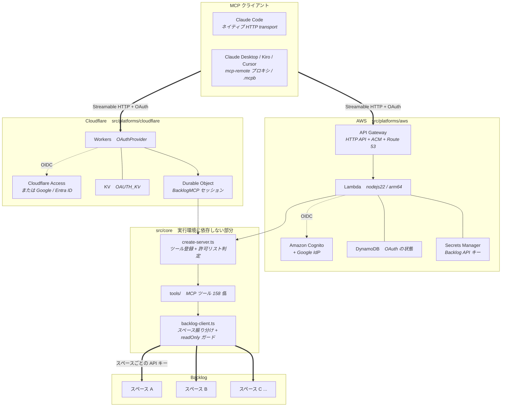
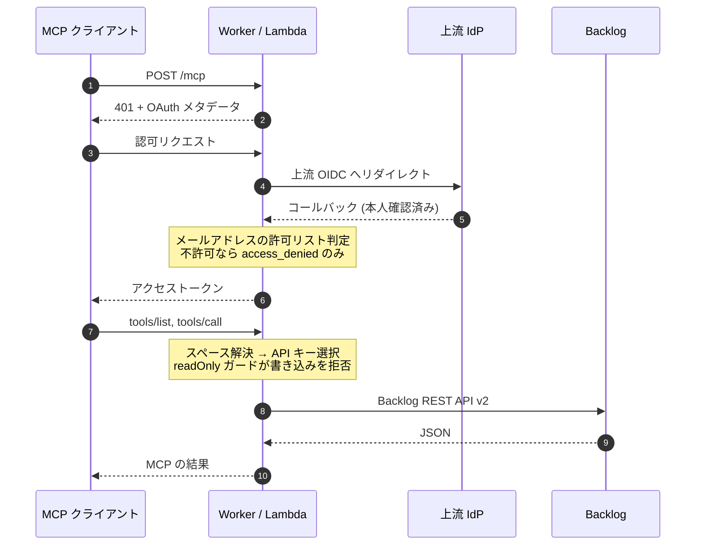

# Backlog Remote MCP Server

Backlog を MCP (Model Context Protocol) 経由で操作するリモートサーバです。
**Cloudflare Workers と AWS のどちらにもデプロイできます。**

[English](README.md) | 日本語

## 特徴

- **マルチスペース対応** — 複数の Backlog スペースを 1 つのサーバから扱えます
- **読み取り専用ガード** — 共用スペースを `readOnly` にすると書き込み系 API を拒否します
- **OAuth 2.1 + PKCE** — 動的クライアント登録 (DCR) に対応し、MCP クライアントから直接接続できます
- **メールアドレスによる認可** — 許可リストで利用者を限定します
- **2 つの実行環境** — ビジネスロジックを共有したまま Cloudflare / AWS のどちらでも動きます

## デプロイ先を選ぶ

| | Cloudflare Workers | AWS |
|---|---|---|
| 実行環境 | Workers (エッジ) | Lambda + API Gateway HTTP API |
| MCP セッション | Durable Objects | ステートレス |
| OAuth 認可サーバ | `@cloudflare/workers-oauth-provider` | MCP SDK の `mcpAuthRouter` |
| 上流 IdP | Cloudflare Access | Amazon Cognito |
| 状態保存 | Workers KV | DynamoDB (TTL) |
| シークレット | Workers Secrets | Secrets Manager |
| IaC | wrangler | AWS SAM |
| 設定ファイル | `.dev.vars` | `infra/aws/params.yaml` |

提供されるツールと挙動はどちらも同じです。

## 概算コスト

> **Note**
> **あくまで参考値です。** 実際の料金はリージョン・利用量・料金改定で変わります。
> 見積もりは各社の公式ツールで行ってください。
>
> - [Cloudflare Zero Trust の料金](https://www.cloudflare.com/plans/zero-trust-services/)
> - [Cloudflare Workers の料金](https://developers.cloudflare.com/workers/platform/pricing/)
> - [AWS Pricing Calculator](https://calculator.aws/#/addService)

### 前提

個人〜小規模チームでの利用を想定します。

| 項目 | 想定 |
|---|---|
| 利用者 | 1〜5 名 |
| MCP リクエスト | 月 3,000 回程度 |
| Backlog スペース | 3 つ |
| ログ保持 | 30 日 |

### 固定費 (使わなくてもかかる)

| | Cloudflare | AWS |
|---|---|---|
| 実行環境 | $0 (Free プランで可) | $0 |
| 認証基盤 | $0 (Zero Trust 50 名まで無料) | $0 (Cognito 無料枠内) |
| シークレット | $0 (Workers Secrets は無料) | **約 $0.80** (Secrets Manager × 2) |
| 証明書 | $0 | $0 (ACM の公開証明書は無料) |
| **合計** | **$0** | **約 $1/月** |

**AWS 側の固定費はほぼ Secrets Manager だけです。** 1 シークレットあたり月額課金のため、
使わなくても発生します。Cloudflare 側は Workers Secrets が無料なので固定費がありません。

### 従量課金の主な対象

| | Cloudflare | AWS |
|---|---|---|
| リクエスト | Workers | Lambda + API Gateway |
| 状態保存 | Durable Objects + KV | DynamoDB |
| ログ | Workers Logs | CloudWatch Logs |

上記の想定 (月 3,000 リクエスト) であれば、**どちらも各サービスの無料枠に収まる**
規模です。API Gateway HTTP API には恒久的な無料枠がないため、AWS 側は
リクエスト数に比例してわずかに課金されます (100 万リクエストあたり $1 程度)。

### 押さえておきたい分岐点

**Cloudflare — Zero Trust の 50 名**

Zero Trust (Access) は **50 ユーザーまで無料**です。51 名以上になると有料プランへ
移行し、**ユーザー単位の月額課金**に切り替わります。人数が増えるほど費用が
効いてくるのはこちらです。

**Cloudflare — Workers Free プランの上限**

本プロジェクトは SQLite バックエンドの Durable Objects を使っており、
[Workers Free プランでも利用できます](https://developers.cloudflare.com/durable-objects/platform/pricing/)。
ただし Free プランは 1 日あたりのリクエスト数などに上限があり、超えるとエラーになります。
継続的に使うなら Workers Paid ($5/月〜) を検討してください。

**AWS — Lambda の無料枠は恒久的**

Lambda には月 100 万リクエスト / 40 万 GB 秒の恒久的な無料枠があります。
一方 **API Gateway と Secrets Manager には恒久的な無料枠がありません**。

**AWS — CloudWatch Logs**

ログは取り込み量に対して課金されます。本テンプレートは保持期間を
`LogRetentionDays` (既定 30 日) で明示的に管理しており、無期限に蓄積しません。

### まとめ

| 規模 | Cloudflare | AWS |
|---|---|---|
| 個人利用 | ほぼ $0 | 月 $1 程度 |
| 数十名 (50 名以下) | ほぼ $0〜$5 | 月 $1〜数ドル |
| 51 名以上 | Zero Trust がユーザー単位課金に | Cognito 無料枠 (MAU) 次第 |

**少人数なら Cloudflare のほうが安く、固定費もありません。** AWS は Secrets Manager の
固定費が乗りますが、既存の AWS 環境に寄せたい場合や IAM で統制したい場合には利点があります。

## セットアップ

### 0. 前提

Node.js 20 以上が必要です。

```bash
git clone <this-repo>
cd backlog-remote-mcp-server
npm install
```

デプロイ先に応じて追加のツールが要ります。

| デプロイ先 | 必要なもの |
|---|---|
| Cloudflare Workers | Cloudflare アカウント (Workers 有効)、独自ドメイン (任意) |
| AWS | AWS アカウント、AWS CLI v2、AWS SAM CLI |

### 進める順番

1. **[Backlog の API キーとスペース設定](docs/backlog_ja.md)** — 両プラットフォーム共通
2. Identity Provider を選ぶ
   - **[Google Cloud](docs/idp-google_ja.md)**
   - **[Microsoft Entra ID](docs/idp-entra-id_ja.md)**
3. デプロイ先を選ぶ
   - **[Cloudflare Workers 版](docs/deploy-cloudflare_ja.md)**
   - **[AWS 版](docs/deploy-aws_ja.md)**

### 困ったときは

トラブルシューティングは各デプロイ手順書の末尾にあります。

- [Cloudflare 版](docs/deploy-cloudflare_ja.md#トラブルシューティング)
- [AWS 版](docs/deploy-aws_ja.md#トラブルシューティング)


## アーキテクチャ

同じ MCP サーバを 2 つのプラットフォームで動かします。プラットフォームごとの配線
(入口・ストレージ・上流 IdP) はそれぞれの枠内で完結し、どちらも共通部分の
`src/core` に合流します。ツール実装と Backlog クライアントはそこにあります。



### リクエストの流れ



認可は 2 段構えです。上流 IdP が「**誰がログインできるか**」を決め、メールアドレスの
許可リストが「**誰にツールを見せるか**」を決めます。許可リスト外のユーザーには
`access_denied` だけを持つサーバが返ります。スペースの `readOnly` は API 呼び出し層で
GET 以外を拒否するため、個々のツール実装に穴があっても迂回できません。

### ディレクトリ構成

ビジネスロジックと実行環境の配線を分離しています。

```
src/
  core/                    実行環境に依存しない部分
    backlog-client.ts      Backlog API クライアント (readOnly ガードもここ)
    tools/                 MCP ツール 158 個 (公開 API を網羅)
    create-server.ts       MCP サーバの組み立てと認可判定
  platforms/
    cloudflare/            Cloudflare Workers 向けの配線
    aws/                   AWS Lambda 向けの配線
infra/
  aws/                     SAM テンプレートとパラメータ
```

`src/core` は `@modelcontextprotocol/sdk` と `zod` にしか依存せず、実行環境固有の
API を一切参照しません。プラットフォームを追加する場合は `src/platforms/` 配下に
アダプタを足すだけで、ツール実装をそのまま共有できます。
## MCPクライアントからの接続

### Claude Desktop / Kiro / Cursor (mcp-remoteプロキシ経由)

```json
{
  "mcpServers": {
    "backlog": {
      "command": "npx",
      "args": [
        "mcp-remote",
        "https://<MCP_HOSTNAME>/mcp"
      ]
    }
  }
}
```

初回接続時にブラウザが開き、認証を求められます。

### Claude Desktop (.mcpb バンドル)

上の JSON を手で書く代わりに、`.mcpb` (MCP Bundle) をダブルクリックで
インストールできます。デプロイ時に自動生成され、`dist/` に出力されます。

```bash
npm run mcpb:pack           # 単体で生成
npm run aws:deploy          # デプロイのついでに生成 (Cloudflare は npm run cloudflare:deploy)
```

エンドポイント URL は `user_config` になっており、**デプロイ先のドメインが
既定値として埋め込まれます**。フォークして自分の環境にデプロイした場合は、
そのデプロイ先が既定値になります。インストール時に画面から変更もできます。

ホスト名の解決順は次のとおりです。

1. `--host` 引数
2. `MCP_HOSTNAME` 環境変数 (Cloudflare デプロイと共通)
3. `infra/aws/params.yaml` の `ApiDomainName` (AWS デプロイ)
4. `.dev.vars` の `MCP_HOSTNAME`

**バンドルにサーバ本体は入っていません。** MCPB はローカル実行専用の形式で、
manifest の `server.type` は `node` / `python` / `binary` / `uv` しかなく、
リモートの MCP サーバを直接指す型が存在しないためです。中身は
`mcp-remote` を stdio プロキシとして同梱したもので、そこからデプロイ済みの
サーバへ繋ぎます。実行時に `npx` でネットワークを叩かないよう、
`mcp-remote` は同梱済みです。

Claude Code はこのバンドルを使いません (`claude mcp add --transport http` のまま)。

### MCP Inspector (テスト用)

```bash
npx @modelcontextprotocol/inspector@latest
```

Inspector画面で `https://<MCP_HOSTNAME>/mcp` を入力し、OAuth Settingsから認証フローを実行します。

## 使い方

### スペースの指定

すべてのツールに `space` パラメータ(オプション)があります:

```
# デフォルトスペースを使用
「PROJECT-KEYプロジェクトの課題一覧を見せて」

# 特定のスペースを指定
「PERSONALスペースのプロジェクト一覧を見せて」
→ space: "PERSONAL" を指定
```

### 利用例

```
# 設定されたスペース一覧を確認
「利用可能なバックログスペースを教えて」→ list_spaces

# プロジェクト一覧
「COMPANY_Aのプロジェクト一覧」→ get_project_list(space: "COMPANY_A")

# 課題作成
「PROJECT-KEYに新しいバグ課題を作って」→ add_issue(...)

# PR一覧
「repo-nameのオープンなPRを見せて」→ get_pull_requests(...)
```

## 利用可能なツール

| カテゴリ | ツール |
|---------|--------|
| Space | list_spaces, get_space, get_users, get_myself |
| Project | get_project_list, get_project, add_project, update_project, delete_project, get_project_users |
| Issue | get_issue, get_issues, count_issues, add_issue, update_issue, delete_issue, get_issue_comments, add_issue_comment, get_priorities, get_issue_types, get_categories, get_version_milestones, add_version_milestone, get_resolutions |
| Wiki | get_wiki_pages, get_wikis_count, get_wiki, add_wiki |
| Git | get_git_repositories, get_git_repository, get_pull_requests, get_pull_request, add_pull_request, update_pull_request, get_pull_request_comments, add_pull_request_comment |
| Notification | get_notifications, get_notifications_count, reset_unread_notification_count, mark_notification_as_read |

`add_*` / `update_*` / `delete_*` は書き込み系です。`readOnly: true` を設定したスペースに対してこれらを呼ぶと、Backlog APIへリクエストを送る前に拒否されます。`list_spaces` で各スペースの `readOnly` 状態を確認できます。

## セキュリティ

- **認証**: Cloudflare Access → Google / Microsoft Entra ID。OAuthフロー全体がCloudflare側で管理
- **認可**: `ALLOWED_EMAILS` で許可メールアドレスをホワイトリスト管理
- **二重チェック**: Access Policy (Cloudflare側) + アプリケーション内allowlist (Worker側)
- **APIキー保護**: Backlog APIキーはCloudflare Secretsに格納。クライアントには一切露出しない
- **PKCE + CSRF**: OAuth flowはPKCE (S256) とCSRFトークンで保護
- **クライアント同意**: 動的クライアント登録 (DCR) は誰でも叩けるため、認可の前に同意画面でクライアント名とリダイレクト先を提示し、CSRF 保護付きの承認を要求します。承認は `client_id` + `redirect_uri` の組で記録するため、リダイレクト先を差し替えた再登録は過去の承認を引き継げません
- **書き込みガード**: `readOnly: true` のスペースはGET以外を拒否。判定は `src/core/backlog-client.ts` のAPI呼び出し層で行うため、個々のツール実装に依存しません
- **設定の分離**: 環境固有の値はすべて `.dev.vars` (Git管理外) に集約。リポジトリにはプレースホルダのみ

### 運用上の注意

- `ALLOWED_EMAILS` がこのサーバーの実質的な認可境界です。Worker前段にZoneレベルのAccessアプリケーションは置かれていません
- `npm run cloudflare:deploy` は `.dev.vars` の値を本番のシークレットとして**上書き**します。ローカルと本番で値を分けたくなった場合は `cloudflare:deploy:no-secrets` を通常のデプロイに使い、シークレット更新は `cloudflare:secrets:push` で明示的に行ってください
- Backlog APIキーはキー所有者の権限をそのまま持ちます。書き込みが不要なスペースには読み取り専用のキーを発行し、あわせて `readOnly: true` を設定するのが確実です

## ローカル開発

ローカル実行は Cloudflare Workers 版 (`wrangler dev`) で行います。ビジネスロジックは
`src/core` に集約されているため、ここで確認した挙動は AWS 版でもそのまま通用します。

```bash
cp .dev.vars.example .dev.vars   # 各値を設定
npm run dev
# http://localhost:8788/mcp で起動
```

`wrangler dev` は KV と Durable Object をローカルでエミュレートするため、実際の
Cloudflare リソースには触れません。

### 疎通確認

OAuth から MCP ツール実行までを一括で確認できます。

```bash
npm run check:local
```

以下の順に実行され、途中でブラウザが開くのでログインを完了させてください。

1. Authorization Server メタデータの取得
2. 動的クライアント登録
3. ブラウザで承認 → IdP ログイン
4. PKCE によるトークン交換
5. `initialize` / `tools/list`
6. `get_space` を実際に呼び出して Backlog からの応答を確認

`tools/list` に `access_denied` の 1 件だけが返る場合は、ログインしたメールアドレスが
許可リストに含まれていません。

**デプロイ済みのエンドポイントに対しても使えます。**

```bash
npm run check:local -- --base https://your-deployed-host
```

### HTTPS で起動する

IdP のリダイレクト URL が `http://` を受け付けない場合に使います。

```bash
npm run dev:https
# https://localhost:8788/mcp で起動 (自己署名証明書)
```

### 型チェックとテスト

プラットフォームごとに型を分離しているため、AWS 側で Workers のグローバルを
誤用するとエラーになります (逆も同様)。

```bash
npm run type-check   # tsconfig.cloudflare.json と tsconfig.aws.json の両方
npm test             # 下記のテストをまとめて実行
```

| コマンド | 対象 |
|---|---|
| `npm run test:aws-oauth` | OAuth 認可サーバのロジック (DCR、PKCE、トークンの使い捨て、スコープ、失効) |
| `npm run test:aws-consent` | 同意画面 (HTML エスケープ、署名 Cookie、CSRF、承認ゲート) |
| `npm run test:aws-store` | DynamoDB ストアのクライアント登録 TTL と延長 |

いずれも外部サービスに接続せず、DynamoDB と上流 IdP はスタブに差し替えて動きます。

### 設定ファイル

| ファイル | 用途 | Git |
|---|---|---|
| `.dev.vars` | ローカル開発 + Cloudflare デプロイ | 除外 |
| `.dev.vars.example` | 上記のひな形 | コミット |
| `infra/aws/params.yaml` | AWS デプロイ | 除外 |
| `infra/aws/params.example.yaml` | 上記のひな形 | コミット |

実値の書き方はそれぞれのデプロイ手順を参照してください。

## License

MIT
